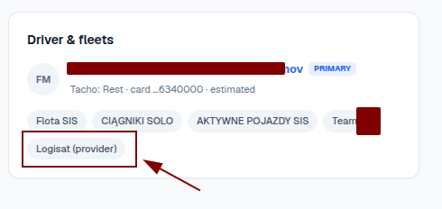

# SIS Telematics Guidebook

Hey, I am Tomek, I do my best to serve you and help with migration to the newer version of Telematics system - the goal is wide-company adoption of the system. After weeks of collaboration, I saw repeated patterns and questions that is why, I share this guidebook to make our common work more efficient. ;-)

0. Please write more description when you find bug, do not write me that "XYZ does not work" for example: "Tacho does not work", it is almost meaningless due to lack of description and specificity. Please elaborate more in the FIRST message (for example: For vehicle "KKABCDE" when I click on Drivers tab, then click [specific driver] then I click "Driver working time" shows ABC and I expect to see DEF). The goal is that I need to find the bug as fast as possible and be able to understand what YOU EXPECT - YOUR expectation is VERY VALUABLE for me. I am nothing without YOUR FEEDBACK. I appreciate it!!!
1. I am not responsible for filling proper data in Logisat, sorry. That is not my part of the job. I am responsible for delivering and improving Telematics but not for data in Logisat. I do not have influence on functionalities in Logisat.

2. Your feedback/bugs is VERY, VERY valuable for the Company and for me, because it helps me to improve the whole system.

In the future, could be more come to the guidebook (and you are invited to those improvements!!!).

Have a good day, Heros ;-)
